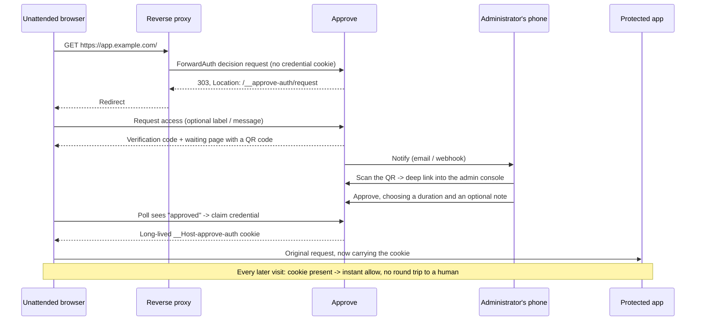
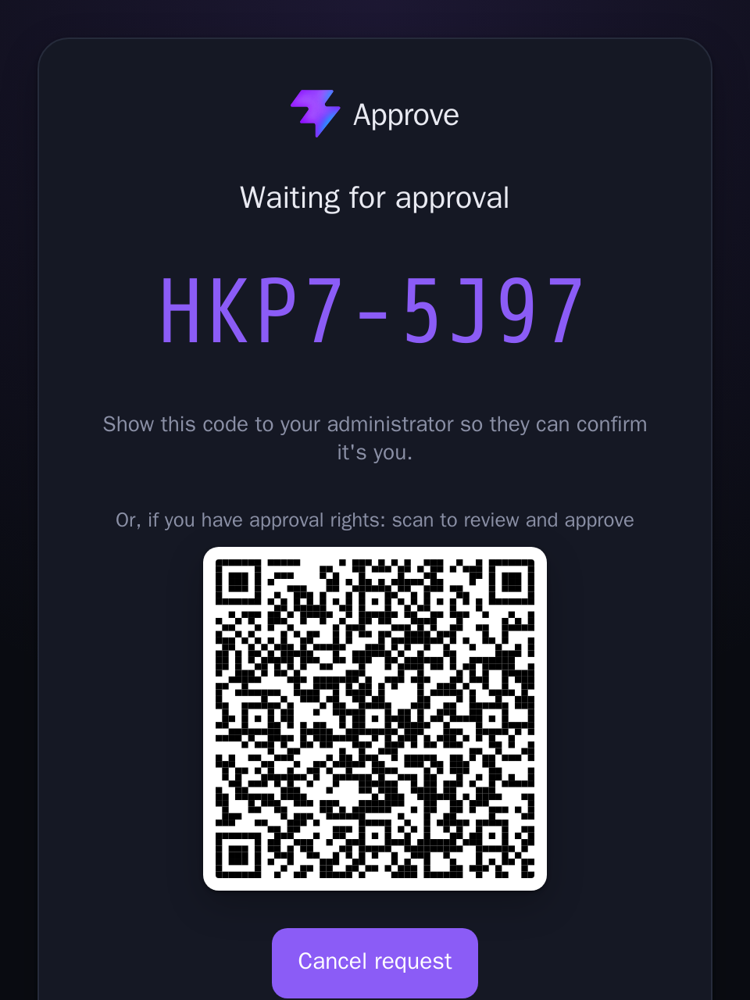
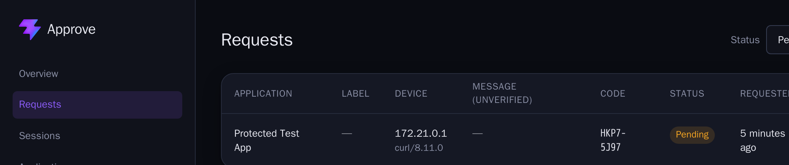
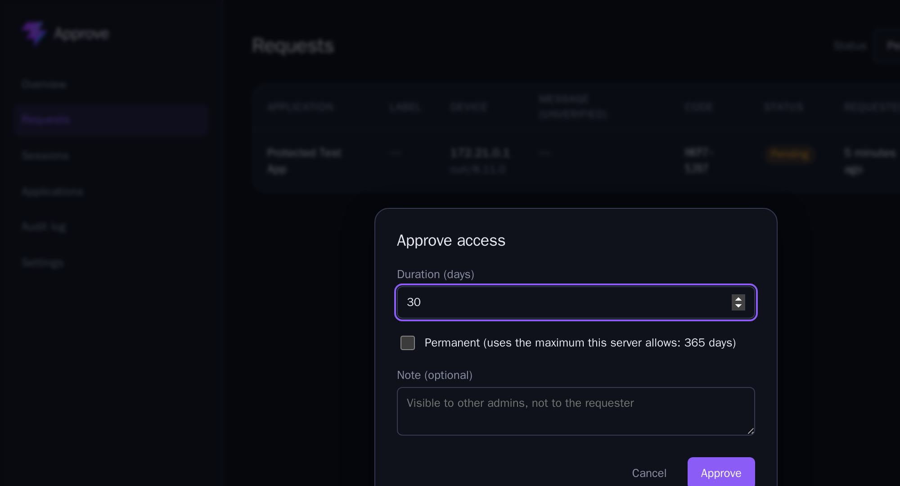
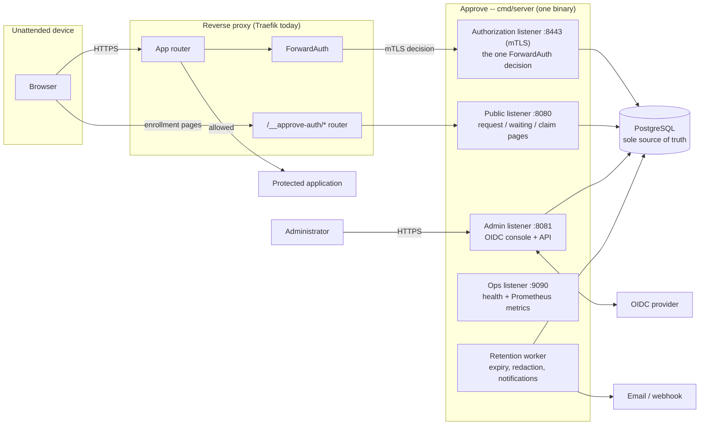

<p align="center">
  
</p>

<h1 align="center">Approve</h1>

<p align="center">
  <b>Authorize unattended browsers — no device software, no user login.</b><br />
  A human vouches for the device once; it just works after that.
</p>

---

**Approve** (repo/service name: `approve-auth`) sits in front of an internal
web application via your reverse proxy's ForwardAuth (or equivalent) hook.
When an unrecognized browser shows up — a reception TV, a warehouse
Andon board, a kiosk in a location you don't manage — it's redirected to a
simple request page instead of a login form. An administrator reviews and
approves that request once, from anywhere. The browser then holds a
long-lived credential and never has to ask again, until someone revokes it.

No agent to install. No device to enroll in an MDM. No user account for the
device to log into. Just a browser, and a human who vouches for it.

## How it works



1. **Redirect.** The proxy asks Approve's Authorization listener whether
   this request may proceed. No valid credential cookie means "no" — the
   browser is bounced to Approve's own request page, on the same host.
2. **Request.** The device (or a human standing in front of it) submits a
   request, optionally with a label and message. Approve issues a
   verification code and starts a waiting page that polls automatically —
   and, while the request stays pending, shows a QR code.
3. **Notify & approve.** Approve can email or webhook whoever's on call.
   An administrator either opens the console directly, or scans the QR
   code on the waiting screen with their phone, which deep-links straight
   into that one request — no hunting through a table first. Either way
   they see the application, verification code, source IP/geo, and the
   unverified label/message, and approve it for a chosen duration (with
   an optional private note) or deny it.
4. **Claim.** The waiting browser detects the approval, claims its
   credential, and gets a `__Host-...` cookie scoped to that one
   application's hostname. It's redirected back to whatever it originally
   asked for.
5. **Just works.** Every subsequent request carries the cookie. The
   Authorization listener checks it against PostgreSQL directly — no
   caching, no stale allow — and answers in-path with no human involved,
   until the credential expires, is revoked, or trips a revocation-policy
   signal (IP/User-Agent change, inactivity).

<p align="center">
  <br />
  <sub>The waiting page — the QR is only shown while the request is still pending.</sub>
</p>

<p align="center">
  <br />
  <sub>What scanning the QR leads to (or the desktop console): the pending request, labeled unverified.</sub>
</p>

<p align="center">
  <br />
  <sub>Approving with a chosen duration and an optional note (visible to other admins, never to the requester).</sub>
</p>

## Architecture



Four independently-routed listeners, one PostgreSQL database as the sole
authoritative state store, no other moving parts:

| Listener | Purpose |
|---|---|
| **Authorization** (mTLS) | The one decision the proxy calls per request: allow, deny, or redirect. Reads PostgreSQL live — an authorization can be revoked and the very next request reflects it. |
| **Public** | The reserved `/__approve-auth/*` paths: request a device, watch it wait, claim a credential. No authentication of its own — that's the point. |
| **Admin** | OIDC (or anonymous-mode, for deployments that already gate access another way) login and the console: approve/deny, revoke, manage applications, audit log, live settings. |
| **Ops** | `/livez`, `/readyz`, `/metrics` — internal network only. |

`cmd/admin` is a separate operator CLI (register an application, run
migrations, revoke an admin session urgently, purge the audit log) that
talks to PostgreSQL directly — never a network listener. See `docs/adr/`
for why.

## Capabilities beyond the basic flow

- **Approve by scanning a QR code** — the waiting page's QR deep-links
  an authorized admin straight into that specific pending request from
  their phone; scanning it is a normal link, not a bypass, so it still
  goes through the same OIDC-authenticated admin console either way.
- **Per-application and per-session revocation policy** — configurable
  response (warn / flag for review / revoke) to a credential's IP address
  changing, its User-Agent changing, or it going inactive past a
  threshold, layered global → application → session.
- **Role-scoped access**: administrator, read-only viewer, and
  application-owner (sees and acts only on their own application's
  requests/sessions).
- **Notifications** — email and/or a generic signed webhook when a new
  request comes in, with per-channel delivery tracking and bounded
  retries.
- **Full audit trail** — every decision, mutation, and admin action,
  independently retained from operational data.
- **Configurable retention** — resolved requests, IP/User-Agent metadata,
  and anonymous request text each redact/expire on their own schedule.
- **GeoIP enrichment** (optional, bring-your-own `.mmdb`), live-editable
  deployment-wide settings (contact info, notification targets,
  revocation defaults) with no restart required.

## What this does and doesn't protect

Approve answers exactly one question: *has a human approved this browser for
this hostname?* It is not a replacement for the protected application's own
authentication, and it is not multi-factor.

- **It authorizes a device, not a person.** The credential is a long-lived
  cookie — anyone with access to that browser, or who can exfiltrate the
  cookie itself (XSS elsewhere on the same site, malware, a stolen or
  unlocked device), has everything the device has, until it's revoked.
  There's no additional factor and no hardware-backed device identity —
  deliberately, since the entire point is zero device-side software.
- **The approval step trusts a human, and a human can be misled.** Anything
  an anonymous device submits — a label, a message — is unverified. The
  console marks it as such; treat it as a claim to check independently,
  never as proof of identity on its own.
- **It's a front door, not an access-control system.** Approve makes one
  coarse allow/deny decision per hostname before a request ever reaches your
  application. It has no concept of your app's own users, roles, or
  permissions — once past Approve, your application's own authentication is
  what actually decides who can do what inside it.
- **Scope it to entry navigation, not every API call** the protected app
  makes internally, the way the reference Traefik config does — don't rely
  on it to gate an endpoint that's independently reachable.

For anything sensitive — PII, financial data, admin or destructive actions,
anywhere that knowing *who* is acting actually matters — put real user
authentication (and MFA) inside the application itself, and run Approve as
one layer of a defense-in-depth stack, not the whole stack. See
`docs/threat-model.md` for the itemized threat model this section
summarizes.

## Status

Reverse-proxy integration ships today for **Traefik** (ForwardAuth,
`deploy/traefik-approve-auth-middleware.yml`). The Authorization
listener's contract (a handful of `X-Forwarded-*` headers, mTLS, and a
204/303/401/403/503 response contract) is proxy-agnostic in principle —
see `docs/threat-model.md` and `docs/security-review.md` for what's
implemented vs. explicitly deferred, and `docs/acceptance-criteria.md`
for the full sign-off walkthrough.

## Start here

- **Operators deploying this for real:** `docs/runbooks/rollout-rollback.md`,
  then `docs/runbooks/key-rotation.md` and `docs/runbooks/backup-restore.md`
  before you need them under pressure.
- **Developers working on this repo:** `docs/dev-environment.md` for the
  containerized local setup (no Go/Node/mkcert install on the host), then
  the section below.
- **Understanding what this service does and doesn't do:** `docs/threat-model.md`
  and `docs/acceptance-criteria.md`.
- **API contracts:** `api/public.yaml` and `api/admin.yaml` (OpenAPI 3.1,
  validated in CI against the real implementation, not a draft).

## Development

No Go, Node, or mkcert install is required on the host. Every build/test/lint
command runs inside a pinned Docker image — see `scripts/dev.sh` (bash) or
`scripts/dev.ps1` (PowerShell), and `docs/dev-environment.md` for the full
local setup including the real-Traefik integration stack and the admin
console's OIDC login flow against `cmd/mock-oidc`.

```bash
scripts/dev.sh build
scripts/dev.sh vet
scripts/dev.sh test
```

```powershell
scripts/dev.ps1 build
scripts/dev.ps1 vet
scripts/dev.ps1 test
```

Database-backed tests skip cleanly (`t.Skip`) without `TEST_DATABASE_URL`
set; see `docs/dev-environment.md` for running them against a real
PostgreSQL instance, and the real-Traefik integration suite.

## Repository layout

| Path | What's there |
|---|---|
| `cmd/server` | The one real service binary: all four listeners, the retention worker |
| `cmd/admin` | Operator CLI: register-application, migrate-up/-down, revoke-admin-session, purge-audit-log |
| `cmd/mock-oidc` | A real (not stubbed) OIDC provider for local dev/CI only -- never production |
| `internal/authz` | The ForwardAuth authoritative decision |
| `internal/enrollment` | Request/waiting/claim browser-facing flow |
| `internal/admin`, `internal/adminsession` | Admin mutation business logic; OIDC login + session |
| `internal/oidc` | The OIDC Authorization Code + PKCE client |
| `internal/notify` | Email / webhook notification delivery |
| `internal/revokepolicy` | The layered IP/User-Agent/inactivity revocation policy engine |
| `internal/store` | All PostgreSQL access; migrations live in `migrations/` |
| `internal/httpserver` | The four listeners' HTTP handlers |
| `internal/worker` | Retention/cleanup jobs |
| `internal/metrics` | Prometheus metrics |
| `internal/config` | Config loading, secret handling, validation |
| `web/admin` | The Svelte admin console, embedded into the Go binary |
| `web/public` | Server-rendered, no-JS-capable request/waiting pages |
| `api/` | OpenAPI 3.1 contracts, validated in CI |
| `deploy/` | The Swarm deployment manifest (`stack.yml`) and its supporting files |
| `deploy/dev/` | The local dev/test stack (real Postgres, real Traefik, real mock OIDC) |
| `docs/` | Threat model, security review, dev environment, runbooks, ADRs |
